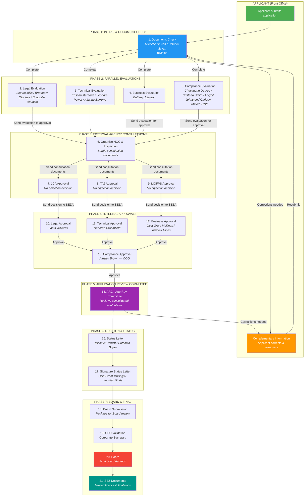

# Service Architecture — Establish a New Zone (Jamaica SEZ)

## Service Overview

| Field | Value |
|-------|-------|
| **Service Name** | Establish a new zone |
| **Service ID** | `d51d6c78-5ead-c948-0b82-0d9bc71cd712` |
| **Country** | Jamaica |
| **URL** | https://jamaica.eregistrations.org |
| **Registrations** | 4 (1 approval + 3 no-objections) |
| **Active Workflow Roles** | 21 |
| **Total Roles** | 49 |
| **Bots** | 8 |
| **Print Documents** | 1 (Developer license) |
| **Document Requirements** | 33 (on Approval SEZA registration) |
| **Form Components** | 469 total, 328 fields, 197 data fields |

## Institutions Involved

| Institution | Full Name | Role | Registration ID |
|-------------|-----------|------|-----------------|
| **SEZA** | Jamaica Special Economic Zone Authority | Lead authority — receives application, evaluates, approves, issues license | `685dfe8b` (Approval SEZA) |
| **JCA** | Jamaica Customs Agency | Issues no-objection letter | `f7b547f2` (No objection JCA) |
| **MOFPS** | Ministry of Finance & Public Services | Issues no-objection letter | `2a70472b` (No objection MOFPS) |
| **TAJ** | Tax Administration Jamaica | Issues no-objection letter | `e937c6d5` (No objection TAJ) |

## Registrations

1. **Approval SEZA** (`685dfe8b`) — The primary registration. SEZA evaluates the application across legal, technical, business, and compliance dimensions, collects no-objections from external agencies, and ultimately grants or denies the zone designation.
2. **No objection JCA** (`f7b547f2`) — Jamaica Customs Agency reviews customs-related aspects and issues a no-objection decision.
3. **No objection MOFPS** (`2a70472b`) — Ministry of Finance reviews fiscal/financial aspects and issues a no-objection decision.
4. **No objection TAJ** (`e937c6d5`) — Tax Administration Jamaica reviews tax compliance and issues a no-objection decision.

## Workflow Diagram



### Workflow Phases Summary

| Phase | Steps | Nature | Key Action |
|-------|-------|--------|------------|
| 1. Intake | Documents Check | Sequential | Verify completeness of 33 required documents |
| 2. Evaluations | Legal, Technical, Business, Compliance | Parallel | Domain-specific review of application |
| 3. External NOC | Organize NOC, JCA, TAJ, MOFPS | Fan-out/Fan-in | Collect no-objection letters from 3 agencies |
| 4. Internal Approvals | Legal, Technical, Business, Compliance | Parallel/Sequential | Senior management sign-off per domain |
| 5. ARC | Application Review Committee | Sequential | Committee reviews consolidated evaluations |
| 6. Decision | Status Letter, Signature | Sequential | Draft and sign status/decision letter |
| 7. Board & Final | Board Submission, CEO, Board, SEZ Docs | Sequential | Board review, final approval, license upload |

## Role Descriptions and Responsibilities

### Phase 1 — Intake

| # | Role | Type | Assigned To | Responsibility |
|---|------|------|-------------|----------------|
| 1 | Documents Check | Revision | Michelle Hewett, Britania Bryan | Review submitted application for completeness. Verify all 33 required documents are present and valid. Route to evaluations or request corrections. |

### Phase 2 — Parallel Evaluations

| # | Role | Type | Assigned To | Responsibility |
|---|------|------|-------------|----------------|
| 2 | Legal Evaluation | Processing | Joanna Mills, Branttany Oforkaja, Shaquille Douglas | Assess legal aspects of the zone proposal. Button: "Send evaluation to approval". |
| 3 | Technical Evaluation | Processing | Krissan Meredith, Leondra Power, Alianne Barrows | Evaluate infrastructure, technical feasibility, site suitability. |
| 4 | Business Evaluation | Processing | Brittany Johnson | Analyze business plan viability, economic impact, job creation. Button: "Send evaluation for approval". |
| 5 | Compliance Evaluation | Processing | Chevaughn Dacres, Cristena Smith, Abigail Johnston, Carleen Clacken-Reid | Review compliance aspects: financial integrity, H&S, disaster recovery, security, customs. Button: "Send evaluation for approval". |

### Phase 3 — External Agency Consultations

| # | Role | Type | Assigned To | Responsibility |
|---|------|------|-------------|----------------|
| 6 | Organize NOC & Inspection | Processing | — | Compile and send consultation documents to JCA, TAJ, MOFPS. Requires file uploads for each agency. Button: "Send consultation documents". |
| 7 | JCA Approval | Processing | Jamaica Customs Agency | Review customs-related aspects and issue no-objection. Button: "Send decision to SEZA". Requires "No objection" radio selection. |
| 8 | TAJ Approval | Processing | Tax Administration Jamaica | Review tax compliance and issue no-objection. Button: "Send decision to SEZA". Requires "No objection" radio selection. |
| 9 | MOFPS Approval | Processing | Ministry of Finance | Review fiscal aspects and issue no-objection. Button: "Send decision to SEZA". Requires "No objection" radio selection. |

### Phase 4 — Internal Approvals

| # | Role | Type | Assigned To | Responsibility |
|---|------|------|-------------|----------------|
| 10 | Legal Approval | Processing | Janis Williams (Sr. Director Legal Services) | Senior sign-off on legal evaluation. Button: "Approve". |
| 11 | Technical Approval | Processing | Deborah Broomfield (Director Technical Services & Infrastructure) | Senior sign-off on technical evaluation. Button: "Approve". |
| 12 | Business Approval | Processing | Licia Grant Mullings (Sr. Director BPSS), Yeuniek Hinds (Director SRM) | Senior sign-off on business evaluation. Button: "Approve". |
| 13 | Compliance Approval | Processing | Ainsley Brown (COO) | Senior sign-off on compliance evaluation. Button: "Approve". |

### Phase 5 — Committee Review

| # | Role | Type | Assigned To | Responsibility |
|---|------|------|-------------|----------------|
| 14 | ARC (App Review Committee) | Processing | Committee | Reviews consolidated evaluations, risks, conditions, and agency recommendations. Known issue: EditGrid rows in "new" state can block submission. |

### Phase 5.5 — Corrections Loop

| # | Role | Type | Assigned To | Responsibility |
|---|------|------|-------------|----------------|
| 15 | Complementary Information | Applicant | Applicant (front-office) | Applicant-side role. Receives correction requests, updates application, resubmits. Button: "Validate send page". Not a back-office role. |

### Phase 6 — Decision & Status

| # | Role | Type | Assigned To | Responsibility |
|---|------|------|-------------|----------------|
| 16 | Status Letter | Processing | Michelle Hewett, Britannia Bryan | Draft the official status/decision letter. |
| 17 | Signature Status Letter | Processing | Licia Grant Mullings, Yeuniek Hinds | Sign the status letter. Button: "Approve". |

### Phase 7 — Board & Final

| # | Role | Type | Assigned To | Responsibility |
|---|------|------|-------------|----------------|
| 18 | Board Submission | Processing | — | Prepare and submit package for Board review. Known issue: EditGrid rows in "new" state can block submission. |
| 19 | CEO Validation | Processing | Corporate Secretary | CEO/Corporate Secretary validates submission before Board. |
| 20 | Board | Processing | Board | Final board decision on zone establishment. |
| 21 | SEZ Documents | Processing | — | Upload all end-of-process documents (licence, operating certificate, etc.). |

## Bots

| # | Bot Name | Type | Engine | Purpose | Status |
|---|----------|------|--------|---------|--------|
| 1 | Developer license | Document | generic-pdf-generator | Generate the developer license PDF | **BROKEN** — 0 input, 0 output mappings |
| 2 | DEVELOPERS create | Data | GDB.GDB-ZONE ENTITIES(2.8)-create | Create developer entity record in Global DB | Active |
| 3 | APPROVALS to ARC - conditions to consolidated | Internal | — | Consolidate approval conditions for ARC review | Active |
| 4 | APPROVALS to ARC - risks to consolidated | Internal | — | Consolidate risk assessments for ARC review | Active |
| 5 | DOCUMENTS to LSU-R | Internal | — | Transfer documents to Legal Services Unit (Revision) | Active |
| 6 | APPROVALS to ARC - risks | Internal | — | Transfer risk data to ARC | Active |
| 7 | Docs and data to LSU | Internal | — | Transfer docs and data to Legal Services Unit | Active |
| 8 | NOC to ARC - recommendations agencies | Internal | — | Transfer agency NOC recommendations to ARC | Active |

### Bot Architecture Notes

- **Data flow**: Internal bots move evaluation data and documents between workflow steps, consolidating information for the ARC committee review.
- **Critical issue**: The "Developer license" bot has zero mappings. The license certificate will never be generated until input/output mappings are configured. This is a Phase 0 blocking issue for end-to-end completion.

## Print Documents

| Document | ID | Components | Status | Purpose |
|----------|----|-----------|--------|---------|
| Developer license | `d4a7bdb6` | 30 | Active | Official developer license certificate issued at end of process |

## Form Structure

### Tabs and Navigation

```
Application Form
├── Form (main)
│   ├── Project overview (14 fields)
│   ├── Developer (39 fields)
│   ├── Master plan (128 fields)
│   ├── Business plan (12 fields)
│   └── Compliance
│       ├── Ownership & financial integrity
│       ├── Health & Safety
│       ├── Disaster mitigation & Recovery
│       ├── Security plan
│       ├── Licensing & Permits
│       └── Customs
├── Payment
└── Send
```

### Field Type Distribution

| Type | Count | Notes |
|------|-------|-------|
| number | 43 | Financial figures, measurements, quantities |
| content | 35 | Static text/labels (non-data) |
| radio | 32 | Yes/No decisions, selections |
| textfield | 18 | Short text inputs |
| file | 16 | Document uploads |
| select | 15 | Dropdown selections |
| textarea | 9 | Long text descriptions |
| button | 7 | Action triggers |
| datetime | 5 | Date fields |
| email | 2 | Contact emails |
| checkbox | 2 | Multi-select options |
| survey | 1 | Rating/assessment |

### Data Field Summary

- **Total data fields**: 197
- **Required**: 46 (23%)
- **Optional**: 151 (77%)

## Decision Points Identified

| # | Decision Point | Location | Outcomes | Impact |
|---|---------------|----------|----------|--------|
| 1 | Document completeness | Documents Check (step 1) | Pass → Evaluations / Fail → Complementary Info | Gates the entire workflow |
| 2 | Legal evaluation outcome | Legal Evaluation (step 2) | Positive/Negative/Conditional → forwarded to approval | Feeds into ARC consolidated view |
| 3 | Technical evaluation outcome | Technical Evaluation (step 3) | Positive/Negative/Conditional → forwarded to approval | Feeds into ARC consolidated view |
| 4 | Business evaluation outcome | Business Evaluation (step 4) | Positive/Negative/Conditional → forwarded to approval | Feeds into ARC consolidated view |
| 5 | Compliance evaluation outcome | Compliance Evaluation (step 5) | Positive/Negative/Conditional → forwarded to approval | Feeds into ARC consolidated view |
| 6 | JCA no-objection | JCA Approval (step 7) | No objection / Objection | Required for ARC package |
| 7 | TAJ no-objection | TAJ Approval (step 8) | No objection / Objection | Required for ARC package |
| 8 | MOFPS no-objection | MOFPS Approval (step 9) | No objection / Objection | Required for ARC package |
| 9 | ARC recommendation | ARC (step 14) | Approve / Request corrections / Deny | Major gate — can loop back to applicant |
| 10 | Board decision | Board (step 20) | Approve / Deny | Final decision on zone establishment |

## Known Issues & Risks

| # | Issue | Severity | Impact |
|---|-------|----------|--------|
| 1 | Developer License bot has 0 mappings | **Critical** | License certificate never generated — blocks end-to-end completion |
| 2 | EditGrid rows in "new" state block submission | **High** | ARC and Board Submission steps can get stuck |
| 3 | Complementary Info is applicant-side | **Info** | Test plan must account for front-office/back-office boundary |

## Inactive Roles (Not in Active Workflow)

The following 28 roles exist at sort_order 299 and are not part of the current active workflow. They may represent future phases, alternative paths, or deprecated steps:

- Denial letter, Pre-approval letter, Technical Inspection, Draft License Agreement
- MIC instructions, Ministerial Order approval, Gazette
- Legal review of payment and LA, Issue License Agreement
- Prepare operating certificate, Apply for License Agreement (applicant)
- Inspection, TAJ due diligence, Preparation of Ministerial Bundle
- Draft Ministerial order, Prepare invoice, Technical prepares billing info
- Inspection invite, Approval of billing info, MOFPS due diligence
- Ministerial order legal review, Approves invoices
- Agreement review and payment (applicant), JCA due diligence
- Operating Certificate, DEVELOPER create (BotRole), Developer license (BotRole)
